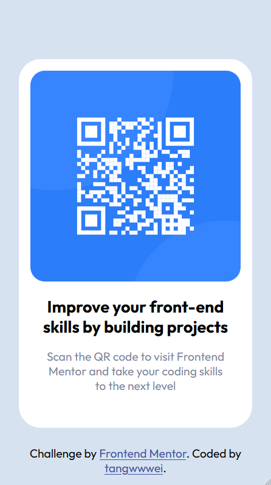

# Frontend Mentor - QR code component solution

## Table of contents

- [Overview](#overview)
  - [Screenshot](#screenshot)
  - [Links](#links)
  - [Built with](#built-with)
  - [What I learned](#what-i-learned)
  - [Continued development](#continued-development)
  - [Useful resources](#useful-resources)
- [Author](#author)
- [Acknowledgments](#acknowledgments)

**Note: Delete this note and update the table of contents based on what sections you keep.**

## Overview

This is a solution to the [QR code component challenge on Frontend Mentor](https://www.frontendmentor.io/challenges/qr-code-component-iux_sIO_H). Frontend Mentor challenges help to improve your coding skills by building realistic projects. 

### Screenshot




### Links

- Solution URL: [Github Repo](https://github.com/tangwwwei/frontendmentor-qr-code)
- Live Site URL: [Github Pages](https://tangwwwei.github.io/frontendmentor-qr-code/)

### Built with

- Semantic HTML5 markup
- Flexbox
- Mobile-first workflow

### What I learned

- This challenge was just right for me in terms of difficulty as I came from Odin project fundamentals, it gave me just the right amount of frustration and subsequent satisfaction from learning to solve it :D
  - Starting from an almost blank css page was daunting but looking at what I've built from there feels good.
- The whole process from the start where you are given a design to replicate, push your work to github, reviewing what you've done and writing documentation on findings, presenting to your team (in this case the frontendmentor community at large) all mimic what a developer would do on a team in real world. 
  - On first impression an overly long process ("yoo i just wanna do the exercise and get feedback!") but i can see the value in this process as I recall how working as a developer was like

- Learnings from the more technical side of things:
  - To center a container that is a direct child of the body element:
  ```css
  html, body {
    height: 100%;
  }
  
  body {
    display:flex;
    align-items: center;
    justify-content: center;
  }
  ```
	- `height:100%` vs `height:100vh`
		- `height:100%` means 100% of the parent element's height
			- To use it to have the same effect as `body {height:100vh}` you need to set its parent's height too since by default it is not defined, so `html, body {height:100%}` will work
			- However, it's important to note that `vh` might not always behave as expected, especially on mobile devices. For instance, some mobile browsers calculate the viewport height once, including the space taken by the URL bar at the top of the screen. When the user scrolls and the URL bar disappears, the viewport height changes, but the `vh` unit does not get updated, leading to unexpected results. In this case, using `height: 100%` might be more reliable, but only if you set `height: 100%` on both the `html` and `body` tags
		- `height:100vh`
			- `vh` stands for viewport height. It is a relative unit of measure, which means it's relative to the viewport.
			- `100vh` therefore means 100% of the viewport height.
  - I had a big problem with linking my local repo to the empty repo I created on github. This was how I fixed it:
    - `git init` your directory, `git add .` all files to staging and make your first commit if you havnt already
    - create new totally empty repo on github
    - copy the SSH link
    - link local to remote using `git remote add origin (SSH link)`
      - you can check the list of remote repos linked using `git remote -v`. you can also set a new remote using `git remote set-url origin (SSH link)`
    - `git branch -M main`
      - optional as later versions of git all initialize with `main` branch rather than `master`
      - The `-M` option is a combination of `--move --force` as per the Git documentation. This command allows the renaming of the branch even if the new branch name already exists
      - This could be useful in situations such as changing the default branch name from `master` to `main` in line with recent changes in naming conventions within the developer community.
    - `git push --set-upstream origin main` or the more common `git push -u origin main`
      - the `-u` option tells Git to set the upstream for the local branch to `origin/<branch name>`, which means that future `git pull` commands without arguments will fetch and merge changes from `origin/<branch name>` into the current local branch. it is the same as `--set-upstream`
      - the term `origin` refers to the default name given to the remote repository from which you cloned. This is part of Git's concept of "remotes", which are essentially nicknames for a repository's full URL, allowing you to refer to another repository without having to input its full URL each time. When you clone a repository for the first time using `git clone`, Git will automatically set up a remote called `origin` to refer to the URL that you cloned from. when you use `git remote -v` you will see the remote referred to as `origin`
    - if you encounter error `failed to push some refs to 'github.com:tangwwwei/frontendmentor-qr-code.git' Updates were rejected because the remote contains work that you do not have locally` and it recommends to `git pull`
      - `git config pull.rebase true` since the remote origin is empty. This will apply your local changes on top of the remote changes (which don't exist since the repository is empty).
      - then `git pull origin main` to pull the changes from the remote repository (which won't have any effect since it's empty)
      - and finally `git push origin main`
  - learning to work from mobile first from [What does it mean to "make a site responsive"? - FED Mentor](https://fedmentor.dev/posts/responsive-meaning/)
  - learning to use relative units for everything
  - learning to use rem units for font [Why font-size must NEVER be in pixels - FED Mentor](https://fedmentor.dev/posts/font-size-px/)
  - a refresh of how easy it is to import fonts into css using `@import url("https://fonts.googleapis.com/css2?family=Outfit:wght@400;700&display=swap");`
  - 

--

(Use this section to recap over some of your major learnings while working through this project. Writing these out and providing code samples of areas you want to highlight is a great way to reinforce your own knowledge.)

To see how you can add code snippets, see below:

```html
<h1>Some HTML code I'm proud of</h1>
```
```css
.proud-of-this-css {
  color: papayawhip;
}
```
```js
const proudOfThisFunc = () => {
  console.log('🎉')
}
```

If you want more help with writing markdown, we'd recommend checking out [The Markdown Guide](https://www.markdownguide.org/) to learn more.

**Note: Delete this note and the content within this section and replace with your own learnings.**

### Continued development

- still unsure about when to use em or rem. ive stuck to using em for all non-font dimensions
- unsure about `max-width: 20rem;` for the container aka main component. using it is the only way i know how to keep the size same for small and wide width screens

(Use this section to outline areas that you want to continue focusing on in future projects. These could be concepts you're still not completely comfortable with or techniques you found useful that you want to refine and perfect.

**Note: Delete this note and the content within this section and replace with your own plans for continued development.**)

### Useful resources

- [Example resource 1](https://www.example.com) - This helped me for XYZ reason. I really liked this pattern and will use it going forward.
- [Example resource 2](https://www.example.com) - This is an amazing article which helped me finally understand XYZ. I'd recommend it to anyone still learning this concept.

**Note: Delete this note and replace the list above with resources that helped you during the challenge. These could come in handy for anyone viewing your solution or for yourself when you look back on this project in the future.**

## Author

- Website - [Add your name here](https://www.your-site.com)
- Frontend Mentor - [@yourusername](https://www.frontendmentor.io/profile/yourusername)
- Twitter - [@yourusername](https://www.twitter.com/yourusername)

**Note: Delete this note and add/remove/edit lines above based on what links you'd like to share.**

## Acknowledgments

- grace snow comments in https://discord.com/channels/824970620529279006/1128476414052667402/1128818425687441540
- 

(This is where you can give a hat tip to anyone who helped you out on this project. Perhaps you worked in a team or got some inspiration from someone else's solution. This is the perfect place to give them some credit.

**Note: Delete this note and edit this section's content as necessary. If you completed this challenge by yourself, feel free to delete this section entirely.**)
